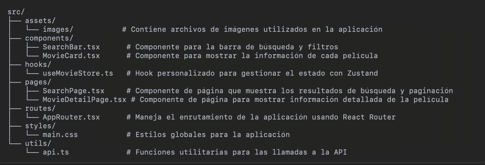
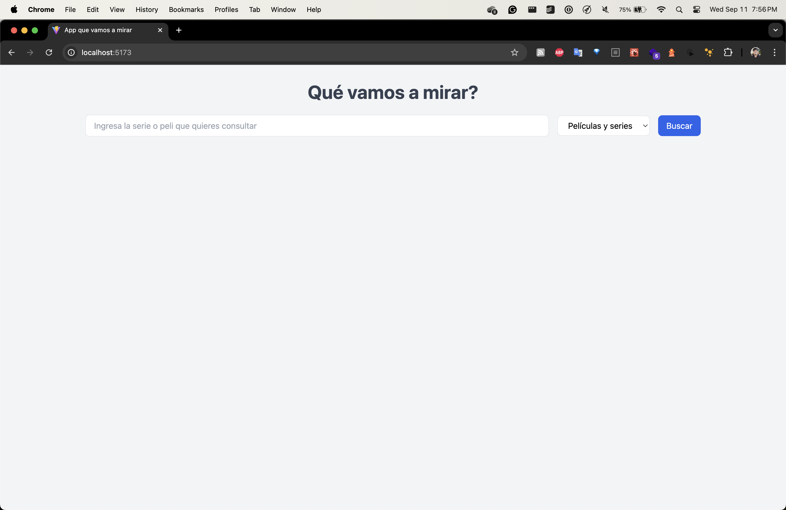
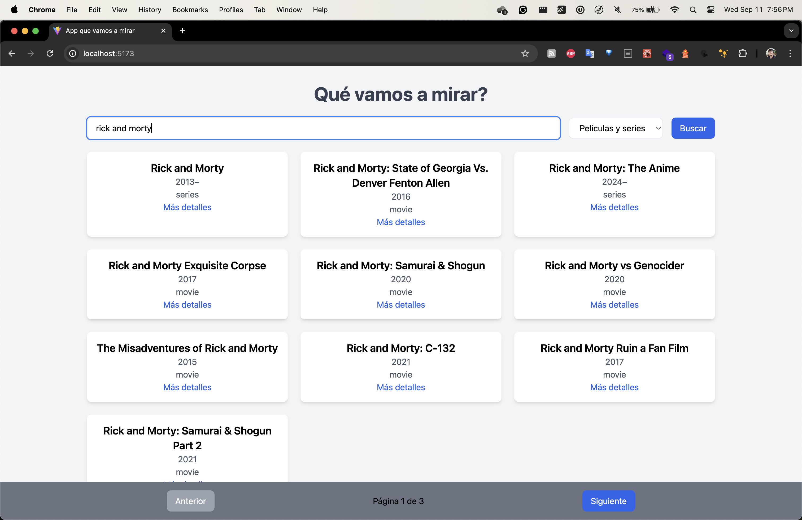
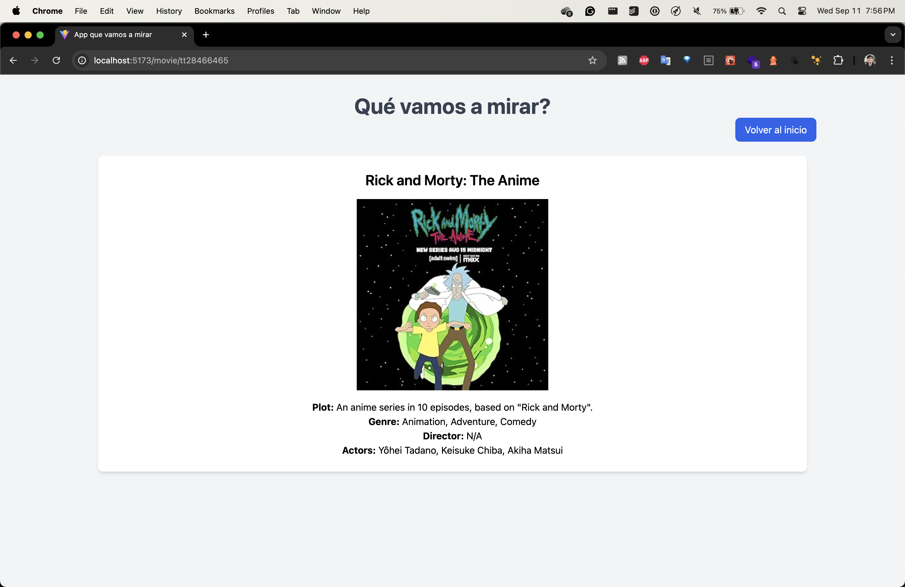
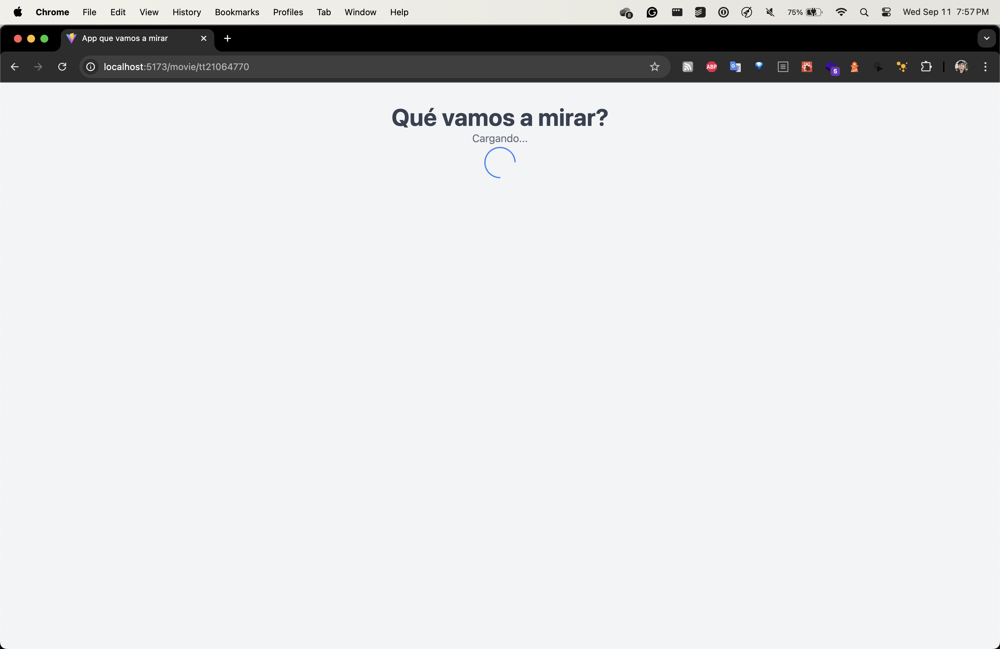
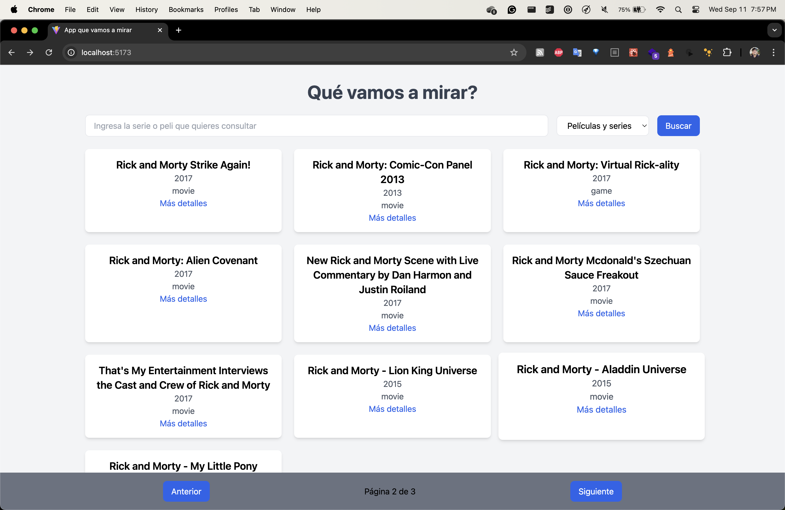

# Que mirar App
## React + TypeScript + Vite

Esta es una web app construida con React, TypeScript y Vite. Su funcionalidad consiste en buscar películas y series 
de televisión consumiendo la api de OMDB.

## Instalación
### Requisitos
- Necesitas usar `Nodejs v20` o superior para poder levantar el proyecto 
- Corre el comando `npm install` para instalar las dependencias del proyecto
- Corre el comando `npm run dev` para levantar el proyecto en modo desarrollo y visualizar la aplicación en tu 
  navegador por el puerto [http://localhost:5173/](http://localhost:5173/)

## Acerca
### Features
-	Búsqueda de Películas/Series
- Los usuarios pueden buscar películas y series de TV por título.
- Filtrar por Tipo - Los usuarios pueden filtrar los resultados por películas, series o ambos.
- Diseño Responsive - La aplicación está diseñada para ser responsiva y amigable con dispositivos móviles.
-	Paginación - Los resultados se muestran paginados, con botones de anterior y siguiente para navegar a través de los resultados de búsqueda.
-	Manejo de Errores - La aplicación incluye un manejo de errores robusto como asi un fallback.
-	Indicador de Carga - Un indicador de carga muestra el progreso mientras se obtienen los datos desde la API.
### Tecnoloías usadas
-	React: Framework frontend para construir la interfaz de usuario.
-	TypeScript: Tipado estático y seguridad de tipos.
-	Zustand: Solución ligera para la gestión del estado.
-	Tailwind CSS: Framework CSS basado en utilidades para estilos.
-	Axios: Para realizar solicitudes HTTP a la API de OMDB.
-	API de OMDB: Utilizada para obtener datos sobre películas y series de TV.
-	React Router: Para manejar la navegación y el enrutamiento del lado del cliente.
-	React Spinners: Proporciona el indicador de carga mientras se obtienen datos.

### Estructura del Proyecto

### Capturas de Pantalla

----------